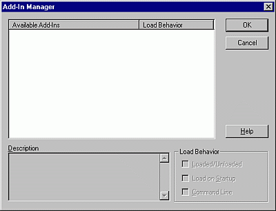

# Add-In Manager Dialog Box

Allows you to register an [add-in](../../Glossary/vbe-glossary.md), load or unload it, and set its load behavior. If you close only the visible portions of an add-in — by double-clicking its system menu or by clicking its Close button, for example — its forms disappear from the screen, but the add-in is still present in memory. The add-in object itself will always stay resident in memory until the add-in is disconnected through the  **Add-In Manager** dialog box.

To open the Add-In Manager, Add-In Manager from the  **Add-Ins** menu.

## Dialog Box Options

 **Add-Ins List**

- Available Add-Ins — Lists available add-ins.
    
- Load Behavior — Displays the load behavior for the selected add-in.
    

 **Description**

Displays a description of what the add-in does.

 **Load Behavior**

- Loaded/Unloaded — Loads or unloads the selected add-in.
    
- Load On Startup — Loads selected add-in on startup of development environment.
    
- Command Line — Loads the selected add-in when the development environment is started from the command prompt or from a script.
    

 **OK**

Updates the load behavior of selected add-ins.

 **Cancel**

Cancels all updates made in session.

