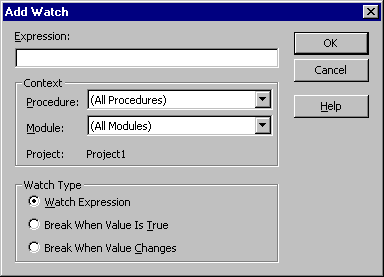

# Add Watch dialog box

Use to enter a [watch expression](../../Glossary/vbe-glossary.md#watch-expression). The expression can be a [variable](../../Glossary/vbe-glossary.md#variable), a property, a function call, or any other valid Basic expression. 

Watch expressions are updated in the [Watch window](watch-window.md) each time you enter [break mode](../../Glossary/vbe-glossary.md#break-mode) or after execution of each statement in the [Immediate window](immediate-window.md).

You can drag selected expressions from the [Code window](code-window.md) into the Watch window.

> [!IMPORTANT] 
> When selecting a context for a watch expression, use the narrowest [scope](../../Glossary/vbe-glossary.md#scope) that fits your needs. Selecting all procedures or all modules could slow down execution considerably because the expression is evaluated after execution of each statement. Selecting a specific procedure for a context affects execution only while the procedure is in the list of active procedure calls, which you can see by choosing the **Call Stack** command on the **[View](view-menu.md)** menu.

The following table describes the dialog box options.

|Option|Description|
|:------|:----------|
|**Expression**|Displays the selected expression by default. The expression is a variable, a property, a function call, or any other valid expression. You may enter a different expression to evaluate.|
|**Context**|Sets the scope of the variables watched in the expression.  - **Procedure**: Displays the procedure name where the selected term resides (default). Defines the procedure(s) in which the expression is evaluated. You may select all procedures or a specific procedure context in which to evaluate the variable.  - **Module**: Displays the [module](../../Glossary/vbe-glossary.md#module) name where the selected term resides (default). You may select all modules or a specific module context in which to evaluate the variable.  - **Project**: Displays the name of the current [project](../../Glossary/vbe-glossary.md#project). Expressions can't be evaluated in a context outside of the current project.|   
|**Watch Type**|Determines how Visual Basic responds to the watch expression.  - **Watch Expression**: Displays the watch expression and its value in the Watch window. When you enter break mode, the value of the watch expression is automatically updated.  - **Break When Value Is True**: Execution automatically enters break mode when the expression evaluates to true or is any nonzero value (not valid for string expressions).  - **Break When Value Changes**: Execution automatically enters break mode when the value of the expression changes within the specified context.|
    
## See also

- [Dialog boxes](../dialog-boxes.md)

