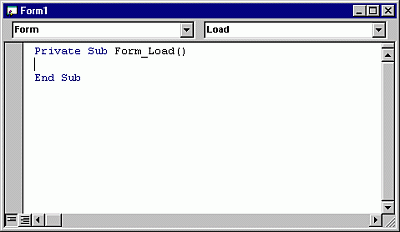

# Code window

Use the Code window to write, display, and edit Visual Basic code. You can open as many Code windows as you have modules, so you can easily view the code in different forms or [modules](../../Glossary/vbe-glossary.md#module), and copy and paste between them.

You can open a Code window from:

- The  Project window, by selecting a form or module, and choosing the **View Code** button.   
- A  [UserForm](userform-window.md) window, by double-clicking a [control](../../Glossary/vbe-glossary.md#control) or form, choosing **Code** from the **View** menu, or pressing F7.
    
You can drag selected text to:

- A different location in the current Code window.   
- Another Code window.    
- The Immediate and Watch windows.   
- The **Recycle Bin**.
    
## Window elements

|Element|Icon|Description|
|:------|:---|:----------|
|**Object** box | |Displays the name of the selected object. Click the arrow to the right of the list box to display a list of all objects associated with the form.|
|**Procedures/Events** box | |Lists all the events recognized by Visual Basic for a form or control displayed in the **Object** box. When you select an event, the event procedure associated with that event name is displayed in the  Code window.  If (General) is displayed in the **Object** box, the **Procedure** box lists any declarations and all of the [general procedures](../../Glossary/vbe-glossary.md#general-procedure) that have been created for the form. If you are editing module code, the **Procedure** box lists all of the general procedures in the module. In either case, the procedure you select in the **Procedure** box is displayed in the Code window.  All the procedures in a module appear in a single, scrollable list that is sorted alphabetically by name. Selecting a procedure by using the drop-down list boxes at the top of the Code window moves the cursor to the first line of code in the procedure you select.|
|**Split** bar| |Dragging this bar down splits the Code window into two horizontal panes, each of which scrolls separately. You can then view different parts of your code at the same time. The information that appears in the **Object** box and **Procedures/Events** box applies to the code in the pane that has the [focus](../../Glossary/vbe-glossary.md#focus). Dragging the bar to the top or the bottom of the window or double-clicking the bar closes a pane.|
|**Margin Indicator** bar| |A gray area on the left side of the  Code window where [margin indicators](../../Glossary/vbe-glossary.md#margin-indicator) are displayed.|
|**Procedure View** icon|  |Displays the selected procedure. Only one procedure at a time is displayed in the  Code window.|
|**Full Module View** icon|  | Displays the entire code in the module.|

## Keyboard shortcuts

You can use the following shortcut keys to access commands in the Code window.

|Description|Shortcut keys|
|:-----|:-----|
|View Code window|F7|
|View [Object Browser](object-browser.md)|F2|
|Find|CTRL+F|
|Replace|CTRL+H|
|Find Next|F3|
|Find Previous|SHIFT+F3|
|Next procedure|CTRL+DOWN ARROW|
|Previous procedure|CTRL+UP ARROW|
|View definition|SHIFT+F2|
|Shift one screen down|CTRL+PAGE DOWN|
|Shift one screen up|CTRL+PAGE UP|
|Go to last position|CTRL+SHIFT+F2|
|Beginning of [module](../../Glossary/vbe-glossary.md#module)|CTRL+HOME|
|End of module|CTRL+END|
|Move one word to right|CTRL+RIGHT ARROW|
|Move one word to left|CTRL+LEFT ARROW|
|Move to end of line|END|
|Move to beginning of line|HOME|
|Undo|CTRL+Z|
|Delete current line|CTRL+Y|
|Delete to end of word|CTRL+DELETE|
|Indent|TAB|
|Outdent|SHIFT+TAB|
|Clear all [breakpoints](../../Glossary/vbe-glossary.md#breakpoint)|CTRL+SHIFT+F9|
|View shortcut menu|SHIFT+F10|

## See also

- [Code window editing keys](code-editing-keys.md)
- [Code window general use keys](code-window-general-use-keys.md)
- [Code window menu shortcut keys](menu-shortcut-keys-available-in-the-code-window.md)
- [Code window navigation keys](code-window-navigation-keys.md)
- [Code window and Object Browser icons](icons-used-in-the-object-browser-and-code-windows.md)
- [Split the Code window](../../how-to/split-the-code-window.md)
- [Window elements](../window-elements.md)
