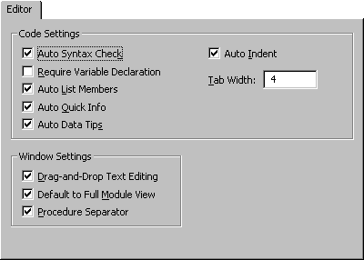

# Editor Tab (Options Dialog Box)

Specifies the  Code window and Project window settings.

## Tab Options

 **Code Settings**

- Auto Syntax Check — Determines whether Visual Basic should automatically verify correct syntax after you enter a line of code.
    
- Require Variable Declaration — Determines whether explicit variable declarations are required in modules. Selecting this adds the Option Explicit statement to general declarations in any new module.
    
- Auto List Member — Displays a list that contains information that would logically complete the statement at the current insertion point.
    
- Auto Quick Info — Displays information about functions and their parameters as you type.
    
- Auto Data Tips — Displays the value of the variable over which your cursor is placed. Available only in Break mode.
    
- Auto Indent — Allows you to tab the first line of code; all subsequent lines will start at that tab location.
    
- Tab Width — Sets the tab width, which can range from 1 to 32 spaces; the default is 4 spaces.
    

 **Window Settings**

- Drag-and-Drop Text Editing — Allows you to drag and drop elements within the current code and from the  Code window into the **Immediate** or Watch windows.
    
- Default to Full Module View — Sets the default state for new modules to allow you to look at procedures in the  Code window either as a single scrollable list or only at one procedure at a time. It does not change the way currently open modules are viewed.
    
- Procedure Separator — Allows you to display or hide separator bars that appear at the end of each procedure in the  Code window.
    

