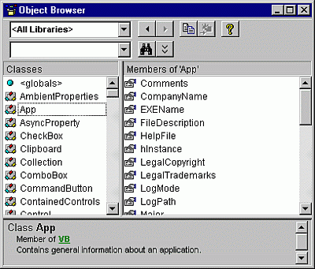

# Object Browser window

Displays the [classes](../../Glossary/vbe-glossary.md#class), properties, methods, events, and constants available from [object libraries](../../Glossary/vbe-glossary.md#object-library) and the [procedures](../../Glossary/vbe-glossary.md#procedure) in your project. You can use it to find and use objects you create, as well as objects from other applications.

You can get Help for the **Object** **Browser** by searching for Object Browser in Help.

## Window elements 

|Element|Description|
|:------|:----------|
|**Project/Library** box| Displays the currently referenced libraries for the active project. You can add libraries in the **References** dialog box. `<All Libraries>` allows all of the libraries to be displayed at one time.|
|**Search Text** box | Contains the string that you want to use in your search. You can type or choose the string you want. The **Search Text** box contains the last four search strings that you enter until you close the project. You can use the standard Visual Basic wildcards when typing a string.  If you want to search for a whole word, you can use the **Find Whole Word Only** command on the shortcut menu.|
| **Go Back** button| Allows you to go back to the previous selection in the **Classes** and **Members Of** lists. Each time you click it, you move back one selection until all of your choices are exhausted.|
| **Go Forward** button| Allows you to repeat your original selections in the **Classes** and **Members Of** lists each time you click it, until you exhaust the list of selections.|
| **Copy to Clipboard** button| Copies the current selection in the **Members Of** list or the **Details** pane text to the Clipboard. You can then paste the selection into your code.|
| **View Definition** button| Moves the cursor to the place in the Code window where the selection in the **Members Of** list or the **Classes** list is defined.|
| **Help** button| Displays the online Help topic for the item selected in the **Classes** and **Members Of** lists. You can also use F1.|
| **Search** button| Initiates a search of the libraries for the class or property, method, event, or constant that matches the string you typed in the **Search Text** box, and opens the **Search Results** pane with the appropriate list of information.|
| **Show/Hide Search Results** button| Opens or hides the **Search Results** pane. The **Search Results** pane changes to show the search results from the project or library chosen in the **Project/Library** list. Search results are listed alphabetically from A to Z.|
|**Search Results** list| Displays the library, class, and member that corresponds to the items that contain your search string. The **Search Results** pane changes when you change the selection in the **Project/Library** box.|
|**Classes** list| Displays all of the available classes in the library or project selected in the **Project/Library** box. If there is code written for a class, that class appears in bold. The list always begins with `<globals>`, a list of globally accessible members.  If you select a class and do not specify a member, you will get the default member if one is available. The default member is identified by an asterisk (*) or by the default [icon](icons-used-in-the-object-browser-and-code-windows.md) specific to the member.|
|**Members Of** list| Displays the elements of the class selected in the **Classes** pane by group and then alphabetically within each group. Methods, properties, events, or constants that have code written for them appear bold. You can change the order of this list with the **Group Members** command on the **Object Browser** shortcut menu.|
|**Details** pane| Shows the definition of the member. The **Details** pane contains a jump to the class or library to which the element belongs. Some members have jumps to their parent class.  For example, if the text in the **Details** pane states that Command1 is declared as a command button type, clicking command button takes you to the **Command Button** class.  You can copy or drag text from the **Details** pane to the Code window.|
|**Split Bar**| Splits the panes so that you can adjust their size. There are splits between the:  - **Classes** box and the **Members Of** box.  - **Search Results** list and the **Classes** and **Members Of** boxes.  - **Classes** and **Members Of** boxes and the **Details** pane.|
    
## Object Browser shortcut menu

|Command|Description|
|:------|:----------|
|Copy | Copies the text for the selected class or member to the Clipboard.|
|Find Whole Word Only  | Allows you to search for occurrences that exactly match the word you typed into the **Search Text** box of the **Object Browser**. |
|Group Members | Toggles the **Members Of** pane between an alphabetical list of the members of the selected class and a list grouped by the member type.|
|Properties  | Displays the **Member Options** dialog box where you type a description of the custom member and give it a Help Context ID and Help File name. Only available for items containing Basic code.|
|Show Hidden Members | Shows and hides the hidden members in the **Object Browser** for each class. Hidden members are members that are not intended for use by the programmer of the reusable object and are not normally visible in the **Object Browser**. They appear as light gray text.|
|View Definition | Takes you to the definition of the selected member.|