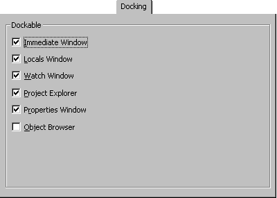

# Options dialog box

Allows you to change default settings for the Visual Basic development environment.

## Editor tab

Specifies the [Code window](code-window.md) and Project window settings.

The following table describes the tab options.

|Option|Settings|
|:-----|:-------|
|**Code Settings**|**Auto Syntax Check**: Determines whether Visual Basic should automatically verify correct syntax after you enter a line of code.  **Require Variable Declaration**: Determines whether explicit variable declarations are required in modules. Selecting this adds the **Option Explicit** statement to general declarations in any new module.  **Auto List Members**: Displays a list that contains information that would logically complete the statement at the current insertion point.  **Auto Quick Info**: Displays information about functions and their parameters as you type.  **Auto Data Tips**: Displays the value of the variable over which your cursor is placed. Available only in break mode.  **Auto Indent**: Allows you to tab the first line of code; all subsequent lines will start at that tab location.  **Tab Width**: Sets the tab width, which can range from 1 to 32 spaces; the default is 4 spaces.|
|**Window Settings**|**Drag-and-Drop Text Editing**: Allows you to drag and drop elements within the current code and from the Code window into the [Immediate](immediate-window.md) or [Watch](watch-window.md) windows.  **Default to Full Module View**: Sets the default state for new modules to allow you to look at procedures in the Code window either as a single scrollable list or only at one procedure at a time. It does not change the way currently open modules are viewed.  **Procedure Separator**: Allows you to display or hide separator bars that appear at the end of each procedure in the Code window.|
    
## Editor Format tab

Specifies the appearance of your Visual Basic code.

The following table describes the tab options.

|Option|Description|
|:-----|:----------|
|**Code Colors**|Determines the foreground and background colors used for the type of text selected in the list box.  **Color Text** list: Lists the text items that have customizable colors.  **Foreground**: Specifies the foreground color for the text selected in the **Color Text** list.  **Background**: Specifies the background color for text selected in the **Color Text** list.  **Indicator**: Specifies the margin indicator color.|  
|**Font**|Specifies the font used for all code.|
|**Size**|Specifies the size of the font used for code.|
|**Margin Indicator Bar**|Makes the margin indicator bar visible or invisible.|
|**Sample**|Displays sample text for the font, size, and color settings.|

## General tab

Specifies the settings, error handling, and compile settings for your current Visual Basic project.

The following table describes the tab options.

|Option|Description and settings|
|:-----|:-----------------------|
|**Form Grid Settings**|Determines the appearance of the form when it is edited.  **Show Grid**: Determines whether to show the grid.  **Grid Units**: Displays the grid units used for the form.  **Width**: Determines the width of grid cells on a form (2 to 60 points).  **Height**: Determines the height of grid cells on a form (2 to 60 points).  **Align Controls to Grid**: Automatically positions the outer edges of controls on grid lines.|
|**Show ToolTips**|Displays ToolTips for the toolbar buttons.|
|**Collapse Proj. Hides Windows**|Determines whether the project, **[UserForm](userform-window.md)**, object, or module windows are closed automatically when a project is collapsed in the **[Project Explorer](project-explorer.md)**.|
|**Edit and Continue**|**Notify Before State Loss**: Determines whether you'll receive a message notifying you that the action requested will cause the all module level variables to be reset for a running project.|
|**Error Trapping**|Determines how errors are handled in the Visual Basic development environment. Setting this option affects all instances of Visual Basic started after you change the setting.  **Break on All Errors**: Any error causes the project to enter break mode, whether or not an error handler is active and whether or not the code is in a class module.  **Break in Class Module**: Any unhandled error produced in a class module causes the project to enter break mode at the line of code in the class module which produced the error.  **Break on Unhandled Errors**: If an error handler is active, the error is trapped without entering break mode. If there is no active error handler, the error causes the project to enter break mode. An unhandled error in a class module, however, causes the project to enter break mode on the line of code that invoked the offending procedure of the class.|
|**Compile**|**Compile On Demand**: Determines whether a project is fully compiled before it starts, or whether code is compiled as needed, allowing the application to start sooner.  **Background Compile**: Determines whether idle time is used during run time to finish compiling the project in the background. **Background Compile** can improve run time execution speed. This feature is not available unless **Compile On Demand** is also selected.|
    

## Docking tab

Allows you to choose which windows you want to be dockable. 

A window is docked when it is attached or "anchored" to one edge of other dockable or application windows. When you move a dockable window, it "snaps" to the location. A window is not dockable when you can move it anywhere on the screen and leave it there.

Select the windows you want to be dockable and clear those that you don't. Any, none, or all of the windows in the list can be docked. 

## See also

- [Set Visual Basic environment options](../../how-to/set-visual-basic-environment-options.md)
- [Dialog boxes](../dialog-boxes.md)

[!include[Support and feedback](~/includes/feedback-boilerplate.md)]
