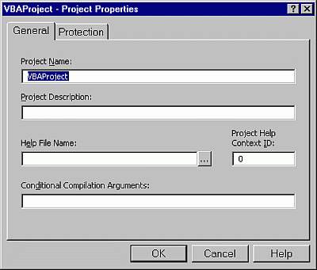
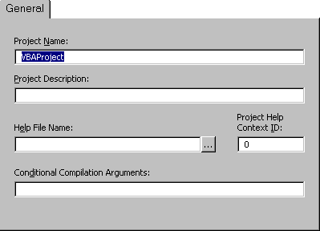
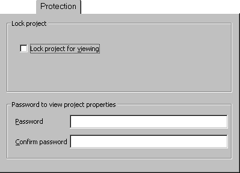
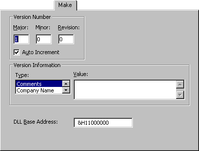
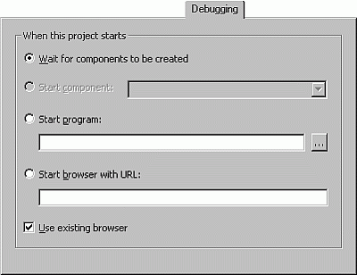

# Project Properties dialog box

Specifies the settings for a specific project.

## General tab

Specifies the settings for the current Visual Basic project. The name of the project is displayed in the title bar.

The following table describes the tab options.

|Option|Description|
|:-----|:----------|
|**Project Name**|Identifies your component in the Windows Registry and the **[Object Browser](object-browser.md)**. It is important that it has a unique name.  The project name is the name of the _type library_ for your component. The type library, or TypeLib, contains the description of the objects and interfaces provided by your component.  It is also used to qualify the names of classes. A combination of project name and class name is sometimes referred to as a _fully qualified class name_, or as a _programmatic ID_. The fully qualified class name may be required to correctly identify an object as belonging to your component.|
|**Project Description**|Sets the descriptive text that is displayed in the **Description** pane at the bottom of the **Object Browser**.|
|**Help File Name**|Displays the name of the Help file associated with the project.|
|**Project Help Context ID**|Lists the context ID for the specific Help topic to be called when the user selects the  button while the application's [object library](../../Glossary/vbe-glossary.md#object-library) is selected in the **Object Browser**.|
|**Conditional Compilation Arguments**|Lists the constant declarations used for conditional compilation. You can set multiple constants by separating them with colons, as in the following example: `conFrenchVersion=-1:conANSI=0` |

## Protection tab

Sets the protection for your project.

The following table describes the tab options.

|Option|Description|
|:-----|:----------|
|**Lock project**|Provides a way to lock your project and prevent someone from changing it.  **Lock project for viewing**: Locks the project so that it cannot be viewed or edited.|
|**Password to view project properties**|Sets the passwords that allow someone to view the project properties.   **Password**: Sets the password for the project. If you do not check the **Lock project for viewing** option but set a password, you will be required to enter a password to open the Property window the next time you open the project.  **Confirm password**: Confirms the password typed in the **Password** box. The contents of the **Confirm password** box and the **Password** box must match when you press **OK** or you get an error.|
    

## Make tab

> [!NOTE] 
> This feature is not available in all versions of the Visual Basic Editor.

Sets the attributes for the [executable file](../../Glossary/vbe-glossary.md#executable-file) you make. Displays the name of the current project in the title so you can determine which project will be affected by any changes you make. The current project is the item currently selected in the [Project Explorer](project-explorer.md).

The following table describes the tab options.

|Option|Description|
|:-----|:----------|
|**Version Number**|Creates the version number for the project.  **Major**: Major release number of the project; 0 - 9999.  **Minor**: Minor release number of the project; 0 - 9999.  **Revision**: Revision version number of the project; 0-9999.  **Auto Increment**: If selected, automatically increases the **Revision** number by one each time you run the **Make Project** command for this project.|   
|**Version Information**|Lets you provide specific information about the current version of your project.  **Type**: Information you can use to set a value. You can enter information for your company name, file description, legal copyright, legal trademarks, product name and comments.  **Value**: The value for the type of information selected in the **Type** box.| 
|**DLL Base Address**|Allows you to set the base address.|
|**Remove information about unused ActiveX Controls**|Allows you to specify that even if a control is unused (present in the **Toolbox**, but not referenced in code), its information will be retained. Uncheck this when you plan to dynamically add the referenced control at run time by using the **Controls** collection's **Add** method.|

## Debugging tab

Allows you to specify additional actions to be taken when the IDE goes into run mode. This feature is not available in Standard EXE projects, only in projects that can create ActiveX components such as User Controls, User Documents, and ActiveX Designers (such as webclasses and DHTML pages). These components are typically consumed by client programs such as Internet Explorer, and the **Debugging** tab automates the process of launching these client programs for the Visual Basic developer.

The following table describes the tab options.

|Option|Description|
|:-----|:----------|
|**When this project starts**|Sets debugging options when your project starts.|
|**Wait for components to be created**|Tells Visual Basic to do nothing in run mode.|
|**Start component**|Lets the component determine what happens. The types of components include special ActiveX Designers like the DHTMLPage Designer and the Webclass Designer, and also User Controls and User Documents. If you select a User Control or User Document, Visual Basic will launch the browser and display a dummy test page that contains the component. The component can tell Visual Basic to either launch the browser with a URL or start another program.  Selecting a startup component on the **Debugging** tab does not affect the Startup Object specified on the **General** tab. For example, an ActiveX.dll project could specify `Startup Object=Sub Main` and `Start Component=DHTMLPage1`.  When the project runs, Visual Basic would register the `DHTMLPage1` component, as well as other components, execute and then launch Internet Explorer, and navigate to a URL that creates an instance of `DHTMLPage1`.|
|**Start program**|Specifies an executable program to be used.|
|**Start browser with URL**|Specifies which URL the browser should navigate to.|
|**Use existing browser**|If Internet Explorer is already running, use it. If not, launch a new browser.|

## See also

- [Set project properties](../../how-to/set-project-properties.md)
- [Dialog boxes](../dialog-boxes.md)

[!include[Support and feedback](~/includes/feedback-boilerplate.md)]