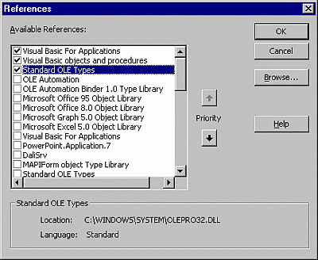

# References Dialog Box

<<<<<<< HEAD
Allows you to select another application's objects that you want available in your code by setting a reference to that application's [object library](../../Glossary/vbe-glossary.md).
=======
Allows you to select another application's objects that you want available in your code by setting a reference to that application's [object library](../../Glossary/vbe-glossary.md#object-library).
>>>>>>> master

## Dialog Box Options

 **Available References**

Lists the references available to your project.

<<<<<<< HEAD
- After you set a reference to an object library by selecting the check box next to its name, you can find a specific object and its methods and properties in the [Object Browser](../../Glossary/vbe-glossary.md).
=======
- After you set a reference to an object library by selecting the check box next to its name, you can find a specific object and its methods and properties in the [Object Browser](../../Glossary/vbe-glossary.md#object-browser).
>>>>>>> master
    
- If you are not using any objects in a referenced library, you should clear the check box for that reference to minimize the number of object references Visual Basic must resolve, thus reducing the time it takes your project to compile. You can't remove a reference for an item that is used in your project.
    
- If you remove a reference to an object that your are currently using in your project, you will receive an error the next time you refer to that object.
    
- References not in use are listed alphabetically.
    
     **Note**  You can't remove the "Visual Basic For Applications" and "Visual Basic objects and procedures" references, because they are necessary for running Visual Basic.

 **Priority Buttons**

Moves references up, 
, and down, 
, on the list. When you refer to an object in code, Visual Basic searches each referenced library selected in the  **References** dialog box in the order the libraries are displayed. If two referenced libraries contain objects with the same name, Visual Basic uses the definition provided by the library listed higher in the Available References box.

 **Result**

Displays the name and path of the reference selected in the Available References box, as well as the language version.

 **Browse**

Displays the  **Add** **Reference** dialog box so that you can search other directories for and add references to the Available Resources box for the following types:

<<<<<<< HEAD
- [Type Libraries](../../Glossary/vbe-glossary.md)(*.olb, *.tlb, *.dll)
    
- [Executable Files](../../Glossary/vbe-glossary.md) (*.exe, *.dll)
=======
- [Type Libraries](../../Glossary/vbe-glossary.md#type-library)(*.olb, *.tlb, *.dll)
    
- [Executable Files](../../Glossary/vbe-glossary.md#executable-file) (*.exe, *.dll)
>>>>>>> master
    
- ActiveX Controls (*.ocx)
    
- All Files (*.*) The  **Add** **References** dialog box is the **Open** common dialog box.
    

