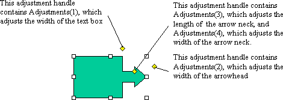

# Adjustments object (Excel)

Contains a collection of adjustment values for the specified AutoShape, WordArt object, or connector.


## Remarks

 Each adjustment value represents one way an adjustment handle can be adjusted. Because some adjustment handles can be adjusted in two ways ? for instance, some handles can be adjusted both horizontally and vertically ? a shape can have more adjustment values than it has adjustment handles. A shape can have up to eight adjustments.

Use the  **[Adjustments](Excel.Shape.Adjustments.md)** property to return an **Adjustments** object. Use **Adjustments** ( _index_ ), where _index_ is the adjustment value?s index number, to return a single adjustment value.

Different shapes have different numbers of adjustment values, different kinds of adjustments change the geometry of a shape in different ways, and different kinds of adjustments have different ranges of valid values. For example, the following illustration shows what each of the four adjustment values for a right-arrow callout contributes to the definition of the callout's geometry. 



    
 **Note**  Because each adjustable shape has a different set of adjustments, the best way to verify the adjustment behavior for a specific shape is to manually create an instance of the shape, make adjustments with the macro recorder turned on, and then examine the recorded code.

The following table summarizes the ranges of valid adjustment values for different types of adjustments. In most cases, if you specify a value that's beyond the range of valid values, the closest valid value will be assigned to the adjustment.


|**Type of adjustment**|**Valid values**|
|:-----|:-----|
|Linear (horizontal or vertical)|Generally the value 0.0 represents the left or top edge of the shape and the value 1.0 represents the right or bottom edge of the shape. Valid values correspond to valid adjustments you can make to the shape manually. For example, if you can only pull an adjustment handle half way across the shape manually, the maximum value for the corresponding adjustment will be 0.5. For shapes such as connectors and callouts, where the values 0.0 and 1.0 represent the limits of the rectangle defined by the starting and ending points of the connector or callout line, negative numbers and numbers greater than 1.0 are valid values.|
|Radial|An adjustment value of 1.0 corresponds to the width of the shape. The maximum value is 0.5, or half way across the shape.|
|Angle|Values are expressed in degrees. If you specify a value outside the range 180 to 180, it will be normalized to be within that range.|

## Example

The following example adds a right-arrow callout to  _myDocument_ and sets adjustment values for the callout. Note that although the shape has only three adjustment handles, it has four adjustments. Adjustments three and four both correspond to the handle between the head and neck of the arrow.


```vb
Set myDocument = Worksheets(1) 
Set rac = myDocument.Shapes.AddShape(msoShapeRightArrowCallout, _ 
 10, 10, 250, 190) 
With rac.Adjustments 
 .Item(1) = 0.5 'adjusts width of text box 
 .Item(2) = 0.15 'adjusts width of arrow head 
 .Item(3) = 0.8 'adjusts length of arrow head 
 .Item(4) = 0.4 'adjusts width of arrow neck 
End With
```


## See also


[Excel Object Model Reference](overview/Excel/object-model.md)

