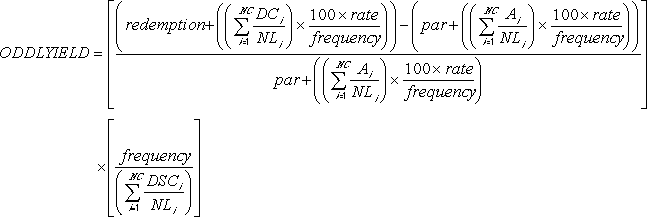

# WorksheetFunction.OddLYield Method (Excel)

Returns the yield of a security that has an odd (short or long) last period.

## Syntax

 _expression_. `OddLYield`( `_Arg1_` , `_Arg2_` , `_Arg3_` , `_Arg4_` , `_Arg5_` , `_Arg6_` , `_Arg7_` , `_Arg8_` )

 _expression_ A variable that represents a [WorksheetFunction](./Excel.WorksheetFunction.md) object.

### Parameters

|Name|Required/Optional|Data type|Description|
|:-----|:-----|:-----|:-----|
| _Arg1_|Required| **Variant**|Settlement - the security's settlement date. The security settlement date is the date after the issue date when the security is traded to the buyer.|
| _Arg2_|Required| **Variant**|Maturity - the security's maturity date. The maturity date is the date when the security expires.|
| _Arg3_|Required| **Variant**|Last_interest - the security's last coupon date.|
| _Arg4_|Required| **Variant**|Rate - the security's interest rate.|
| _Arg5_|Required| **Variant**|Pr - the security's price.|
| _Arg6_|Required| **Variant**|Redemption - the security's redemption value per $100 face value.|
| _Arg7_|Required| **Variant**|Frequency - the number of coupon payments per year. For annual payments, frequency = 1; for semiannual, frequency = 2; for quarterly, frequency = 4.|
| _Arg8_|Optional| **Variant**|Basis - the type of day count basis to use.|

## Return value

Double

## Remarks

 **Important**  Dates should be entered by using the DATE function, or as results of other formulas or functions. For example, use DATE(2008,5,23) for the 23rd day of May, 2008. Problems can occur if dates are entered as text.

|**Basis**|**Day count basis**|
|:-----|:-----|
|0 or omitted|US (NASD) 30/360|
|1|Actual/actual|
|2|Actual/360|
|3|Actual/365|
|4|European 30/360|

- Microsoft Excel stores dates as sequential serial numbers so they can be used in calculations. By default, January 1, 1900 is serial number 1, and January 1, 2008 is serial number 39448 because it is 39,448 days after January 1, 1900. Microsoft Excel for the Macintosh uses a different date system as its default.
    
     **Note**  Visual Basic for Applications (VBA) calculates serial dates differently than Excel. In VBA, serial number 1 is December 31, 1899, rather than January 1, 1900. 
- The settlement date is the date a buyer purchases a coupon, such as a bond. The maturity date is the date when a coupon expires. For example, suppose a 30-year bond is issued on January 1, 2008, and is purchased by a buyer six months later. The issue date would be January 1, 2008, the settlement date would be July 1, 2008, and the maturity date would be January 1, 2038, which is 30 years after the January 1, 2008, issue date.
    
- Settlement, maturity, last_interest, and basis are truncated to integers.
    
- If settlement, maturity, or last_interest is not a valid date, ODDLYIELD returns the #VALUE! error value.
    
- If rate < 0 or if pr ? 0, ODDLYIELD returns the #NUM! error value.
    
- If basis < 0 or if basis > 4, ODDLYIELD returns the #NUM! error value.
    
- The following date condition must be satisfied; otherwise, ODDLYIELD returns the #NUM! error value: maturity > settlement > last_interest 
    
- ODDLYIELD is calculated as follows:
where: Ai = number of accrued days for the ith, or last, quasi-coupon period within odd period counting forward from last interest date before redemption. DCi = number of days counted in the ith, or last, quasi-coupon period as delimited by the length of the actual coupon period. NC = number of quasi-coupon periods that fit in odd period; if this number contains a fraction it will be raised to the next whole number. NLi = normal length in days of the ith, or last, quasi-coupon period within odd coupon period. 
    

## See also

[WorksheetFunction Object](Excel.WorksheetFunction.md)

