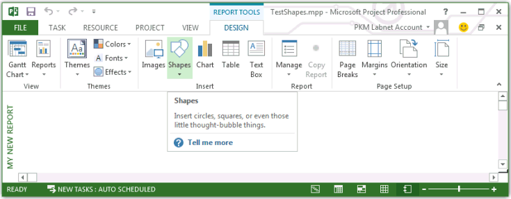

# Report Object (Project)
Represents a report in Project that can contain Office Art objects such as a  **Shape**,  **ReportTable**, or  **Chart**. The  **Report** object is a member of the **Reports** collection.
 

## Remarks


 **Note**  Macro recording for the  **Report** object is not implemented. That is, when you record a macro in Project and manually add a report or edit a report, the steps for adding and editing the report are not recorded.
 


 

 

## Example

To create a report, use the  **[Reports.Add](Project.reports.add.md)** method. For example, the following command creates a report named My New Report.
 

 

```vb
ActiveProject.Reports.Add "My New Report"
```

When you run the command, Project creates the report and then changes the view to the  **DESIGN** tab of the ribbon, under **REPORT TOOLS**. You can use the design tool items on the ribbon to add images, shapes, charts, tables, or text boxes to the report. Alternately, you can programmatically add and edit items in the report by using members of the  **Shape**,  **ShapeRange**,  **Chart**, and  **ReportTable** objects.
 

 

**Figure 1. Creating a report in Project**

 
To delete a report, you must first close the active report view. For example, on the  **DESIGN** tab of the ribbon, in the **View** group, choose a different report in the **Reports** drop-down menu. Then, in the **Report** group on the ribbon, choose **Organizer** in the **Manage** drop-down menu. In the **Organizer** dialog box, choose the **Reports** tab, select **My New Report** in the project pane, and then choose **Delete**.
 

 
To programmatically delete the active report, run the following macro.
 

 


```vb
Sub DeleteTheReport()
    Dim i As Integer
    Dim reportName As String
    
    reportName = "My New Report"
    
    ' To delete the active report, change to another view.
    ViewApplyEx Name:="&amp;Gantt Chart"
    
    ActiveProject.Reports(reportName).Delete
End Sub
```


## Methods


|**Name**|
|:-----|
|[Apply](Project.report.apply.md)|
|[Delete](Project.report.delete.md)|

## Properties


|**Name**|
|:-----|
|[Application](Project.report.application.md)|
|[Index](Project.report.index.md)|
|[Name](Project.report.name.md)|
|[Parent](Project.report.parent.md)|
|[Shapes](Project.report.shapes.md)|

## See also


 
[Chart Object](Project.chart.md)
 
[Reports Object](Project.reports.md)
 
[ReportTable Object](Project.reporttable.md)
 
[Shape Object](Project.shape.md)
 
[ShapeRange Object](Project.shaperange.md)
