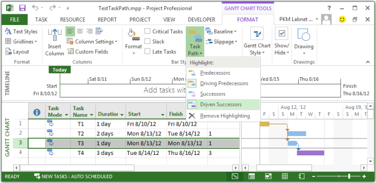

# Task.PathPredecessor Property (Project)
Gets a value that indicates whether the task is a predecessor of the selected task, when the  **Predecessors** item is selected in the **Task Path** drop-down list. Read-only **Boolean**.

## Syntax

 _expression_. `PathPredecessor`

 _expression_ A variable that represents a [Task](./Project.Task.md) object.


## Remarks

The  **Task.PathPredecessor** property is related to the **Predecessors** item on the **Task Path** drop-down list, on the **FORMAT** tab, under **GANTT CHART TOOLS** on the ribbon. Task path is primarily a formatting feature in the Project client, where tasks in the Gantt chart have colors that depend on the current task selection and the relationship of a specified task to the selection. In Figure 1, the **Driving Predecessors** and **Driven Successors** items are selected in the **Task Path** drop-down list. When you select **T3**, the Gantt Chart shows that T1 is a driving predecessor task and T4 is a driven successor task.


**Figure 1. Using the task path properties to highlight tasks**

The  **PathPredecessor** property does not act like the **Predecessors** selection in the user interface. Instead, the **PathPredecessor** property is **True** whenboth of the following conditions are true: (a) the task is a predecessor of the selected task, and (b) the **Predecessors** item is selected in **Task Path**. You can manually select a task or use VBA to select a task, and then use VBA to check whether another task is a predecessor to the selected task. For example, if you select the third task as in Figure 1, and the  **Predecessors** item is selected in **Task Path**, the following statement prints  **True** in the **Immediate** window of the VBE.


```vb
? ActiveProject.Tasks(1).PathPredecessor
```

However, if the  **Predecessors** item is not selected, the previous statement prints **False**. Project does not have a VBA method that can set items in the  **Task Path** drop-down list.


## Example

The  **TestTaskPath** macro selects each task in a project, and then uses the four task path properties in turn to show how the other tasks relate to the selected task.


```vb
Option Explicit

Sub TestTaskPath()
    Dim t As Task
    Dim chkTsk As Task
    Dim selectedTaskId As Integer
    
    For Each t In ActiveProject.Tasks
        selectedTaskId = t.ID
        Application.SelectRow Row:=selectedTaskId, RowRelative:=False
            
        If Not (ActiveSelection.Tasks Is Nothing) Then
            Debug.Print
            
            With ActiveSelection.Tasks(1)
<<<<<<< HEAD
                Debug.Print "Selected task ID " &; .UniqueID &; ", name: " &; .Name
=======
                Debug.Print "Selected task ID " & .UniqueID & ", name: " & .Name
>>>>>>> master
            End With
                        
            For Each chkTsk In ActiveProject.Tasks
                If Not (chkTsk.ID = selectedTaskId) Then
                    If chkTsk.PathPredecessor Then
<<<<<<< HEAD
                        Debug.Print vbTab &; chkTsk.Name &; ": PathPredecessor"
                    End If
                    If chkTsk.PathDrivingPredecessor Then
                        Debug.Print vbTab &; chkTsk.Name &; ": PathDrivingPredecessor"
                    End If
                    If chkTsk.PathSuccessor Then
                        Debug.Print vbTab &; chkTsk.Name &; ": PathSuccessor"
                    End If
                    If chkTsk.PathDrivenSuccessor Then
                        Debug.Print vbTab &; chkTsk.Name &; ": PathDrivenSuccessor"
=======
                        Debug.Print vbTab & chkTsk.Name & ": PathPredecessor"
                    End If
                    If chkTsk.PathDrivingPredecessor Then
                        Debug.Print vbTab & chkTsk.Name & ": PathDrivingPredecessor"
                    End If
                    If chkTsk.PathSuccessor Then
                        Debug.Print vbTab & chkTsk.Name & ": PathSuccessor"
                    End If
                    If chkTsk.PathDrivenSuccessor Then
                        Debug.Print vbTab & chkTsk.Name & ": PathDrivenSuccessor"
>>>>>>> master
                    End If
                End If
            Next chkTsk
        End If
    Next t
End Sub
```

For the project in Figure 1, if the  **Predecessors**,  **Driving Predecessors**,  **Successors**, and  **Driven Successors** items are all selected in **Task Path**, the  **TestTaskPath** macro has the following output:


```vb
Selected task ID 1, name: T1
    T2: PathSuccessor
    T2: PathDrivenSuccessor
    T3: PathSuccessor
    T3: PathDrivenSuccessor
    T4: PathSuccessor
    T4: PathDrivenSuccessor

Selected task ID 2, name: T2
    T1: PathPredecessor
    T1: PathDrivingPredecessor

Selected task ID 3, name: T3
    T1: PathPredecessor
    T1: PathDrivingPredecessor
    T4: PathSuccessor
    T4: PathDrivenSuccessor

Selected task ID 4, name: T4
    T1: PathPredecessor
    T1: PathDrivingPredecessor
    T3: PathPredecessor
    T3: PathDrivingPredecessor
```


## Property value

 **VARIANT**


## See also


[Task Object](Project.Task.md)


[PathDrivingPredecessor Property](Project.task.pathdrivingpredecessor.md)
[PathDrivenSuccessor Property](Project.task.pathdrivensuccessor.md)
[PathSuccessor Property](Project.task.pathsuccessor.md)
